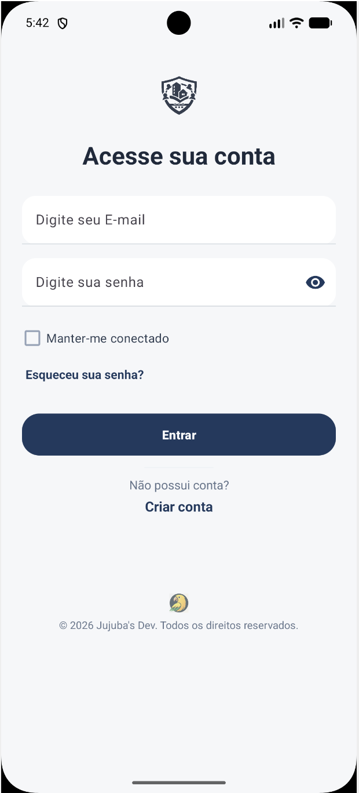
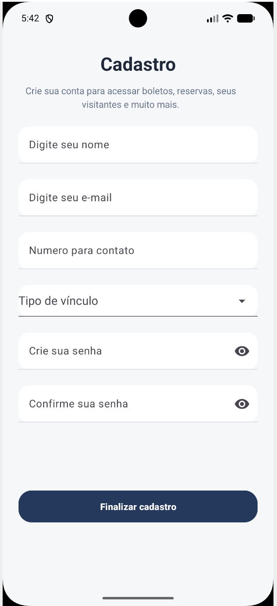
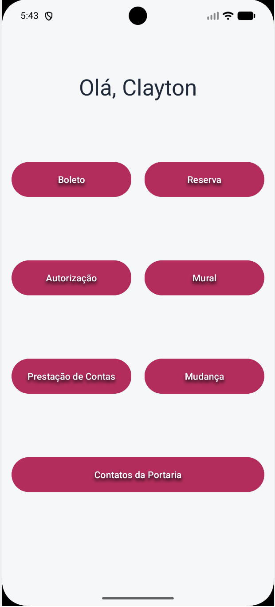

# android-login-app

Simple Android application developed using Kotlin and API with Java + Spring Boot, simulating a basic user authentication flow (Project in progress).

⸻

## Features
	•	User login screen
	•	User registration screen
	•	Navigation between screens (Login, Register, Home)
	•	Basic input validation
	•	Simulated authentication flow

⸻

## Technologies
	•	Kotlin
	•	Android Studio
	•	XML (Layouts)
	•	Java
	•	Spring Boot

⸻
## Screens
	•	Welcome
	•	Login
	•	Register
	•	Home

⸻

## Project Purpose

This project was created to practice Android development fundamentals, including screen navigation, user input handling, and basic application structure.

⸻

## How to Run
	1.	Clone the repository
	2.	Open the project in Android Studio
	3.	Run the application on an emulator or physical device

⸻

## Notes

This is a basic project focused on learning and practicing Android development concepts

## App Screenshots

